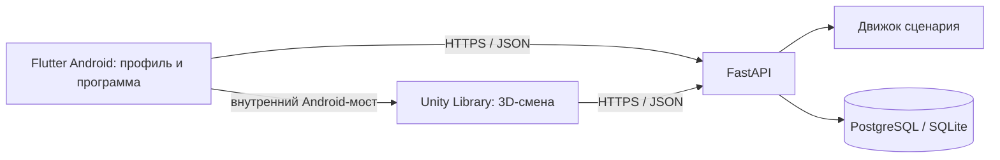

# Архитектура

FastAPI — единственный источник решений по таймерам, ветвлениям, баллам и сохранённым попыткам. Клиенты показывают полученное состояние и отправляют выбранное действие с ревизией и уникальным идентификатором запроса. Повторная отправка подтверждённого действия не начисляет баллы второй раз. Граф сценария сохраняется вместе с попыткой, поэтому последующая правка сценария не меняет старый разбор.

Flutter становится входом в Android-приложение и показывает вертикальные экраны профиля и программы. После интеграции Android запускает Unity как полноэкранную Activity в горизонтальной ориентации, передавая адрес API и токен того же учебного профиля. При возврате Flutter запрашивает свежие данные профиля у сервера. Пока библиотека Unity не встроена, кнопка входа в рейс не должна изображать работающий запуск.

Публичное API описано в OpenAPI по `/docs`. Нынешние `/api/profile`, `/api/leaderboard` и `/api/analytics` предназначены для учебного клиента; отдельные права и контракт интеграции HR/LMS ещё требуются.
